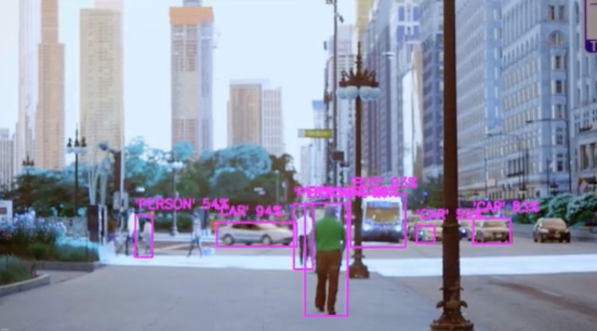

# Object-Recognition-in-Video-with-YOLOv3
In this project, we use YOLOv3 to perform object detection and recognition in video footage.

First, we implemented the Violo-Jones algorithm on a photo of David Beckham.

The code:

```python
def detect_faces(image_path, cascade_Path):

    faceCascade = cv2.CascadeClassifier(cascade_Path)

    frame = cv2.imread(image_path)
    frame = cv2.cvtColor(frame, cv2.COLOR_BGR2RGB)
    gray = cv2.cvtColor(frame, cv2.COLOR_BGR2GRAY)
    faces = faceCascade.detectMultiScale(gray, flags=cv2.CASCADE_SCALE_IMAGE)
    
    return faces, frame
```

The result:


To be able to perform object detection in a video, we must split the video into consecutive frames and then perform the desired task on each frame, we do this with the help of open cv. We know that in each frame we must extract the predicted outputs, so we design a find_objects function as follows.

```python
def find_objects(conf_Thresh, outputs, img):
    height, width, channel = img.shape
    bounding_box = []
    label_Id = []
    bb_conf = []

    for output in outputs:
        for detection in output:
            scores = detection[5:]
            label = np.argmax(scores)
            confidence = scores[label]
            if confidence > conf_Thresh:
                w,h = int(detection[2]* width), int(detection[3]*height)
                x,y = int((detection[0]*width)-w/2), int((detection[1]*height)-h/2)
                bounding_box.append([x,y,w,h])
                label_Id.append(label)
                bb_conf.append(float(confidence))
    return bounding_box, label_Id, bb_conf, height, width
```

Each layer’s output returns a tensor including different detections. Each of these de- tections is a tensor of size 1 × 85, below we present a short description of this tensor:

d = (Pc,x,,y,h,w,c1,c2,...,c80)

• Pc:Probability of existence of an object within the cell • x:x-axis center of the bounding box

• y:y-axis center of the bounding box

• h:height of the bounding box

• w:width of the bounding box

• c_i:1 if class i is in the box,0 if class i is not in the box

Next, we design a function to show the detected objects and their labels on the input video. We also create a new video featuring labels on cars, people and buses.

```python
cap = cv2.VideoCapture(video_dir)
yolo_size = 320
conf_Thresh = 0.5
NMS_Thresh = 0.3
video = []

width = int(cap.get(3))
height = int(cap.get(4))
fps = cap.get(cv2.CAP_PROP_FPS)
out = cv2.VideoWriter('output.mp4', cv2.VideoWriter_fourcc('M','J','P','G'), fps, (width, height))

while True:
    success, img = cap.read()
    if success == False:
      break
    blob = cv2.dnn.blobFromImage(img, 1/255,(yolo_size,yolo_size),[0,0,0],crop=False)
    model.setInput(blob)
    layerNames = model.getLayerNames()
    outputNames = [layerNames[i-1] for i in model.getUnconnectedOutLayers()]
    outputs = model.forward(outputNames)
    bounding_box, label_Id, bb_conf, height, width = find_objects(conf_Thresh, outputs, img)
    image = show_detected_object(labels, desired_labels, bounding_box, label_Id, bb_conf, conf_Thresh, NMS_Thresh)
    out.write(image)
    video.append(image)

cap.release()
out.release()
cv2.destroyAllWindows()
```

Here are some examples of the frames from the output video:

<p float="left">
  
  
  
  
</p>


